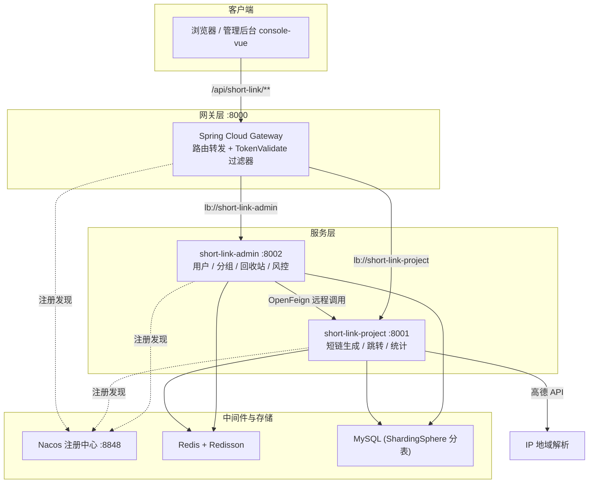
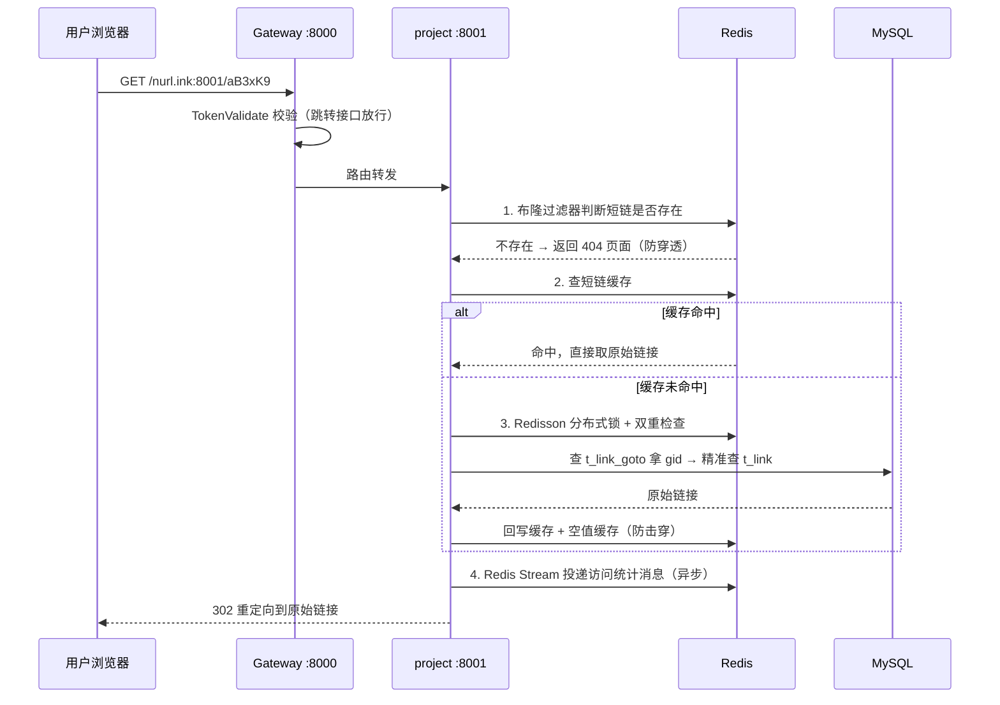

# ShortLink 高性能短链接服务平台

> 面向海量短链接场景的高并发短链接服务。基于 **Spring Cloud 微服务架构**，涵盖短链生成、302 跳转、分组管理、回收站与 PV/UV/UIP 多维访问监控，配套 Vue 3 管理后台与数据看板。

<p>
  
  
  
  
  
  
</p>

---

## 一、项目简介

ShortLink 是一个短链接生成与跳转平台。用户在后管创建一个长链接，系统返回一个"域名 + 6 位短码"的短链接（如 `nurl.ink:8001/aB3xK9`）；访问该短链接时，服务以 **302 重定向** 到原始长链接，同时异步采集本次访问的 PV/UV/UIP、操作系统、浏览器、设备、网络类型、地域等统计数据，供数据看板展示。

系统按职责拆分为 **三个后端微服务 + 一个前端工程**：

| 模块 | 服务名 | 端口 | 职责 |
|---|---|---|---|
| `gateway` | short-link-gateway | 8000 | 统一入口、路由转发、Token 校验与用户信息透传 |
| `admin` | short-link-admin | 8002 | 用户中台：注册登录、分组管理、回收站、用户侧流量风控 |
| `project` | short-link-project | 8001 | 短链接核心：生成 / 跳转 / 统计 / 回收站，分库分表 |
| `console-vue` | smallmark（前端） | Vite 默认 | Vue 3 管理后台与 ECharts 数据看板 |

---

## 二、功能特性

- **短链接生成**：Hash + Base62 生成短码，布隆过滤器全局判重，支持自定义后缀、有效期、描述。
- **批量创建**：一次性批量生成多条短链接，并以 Excel 形式导出。
- **302 跳转**：`GET /{short-uri}` 极速跳转主链路，缓存预热 + 布隆过滤器 + 分布式锁多级防护。
- **分组管理**：分组增删改查、拖拽排序、分组内短链数量统计；支持分组迁移（跨表数据搬迁）。
- **回收站**：短链移入回收站、分页查看、恢复、彻底删除。
- **访问监控**：PV / UV / UIP 趋势、地域（IP 定位）、操作系统、浏览器、设备、网络类型、高频 IP、访问明细。
- **用户体系**：注册（用户名布隆判重）、登录（无状态 Token）、多端会话、脱敏查询。
- **登录态治理**：网关统一鉴权，登录态存 Redis，已登录用户重复登录返回原 Token 并续期。
- **流量风控**：用户侧基于 Lua 脚本的时间窗口限流；短链创建接口接入 Sentinel 流控降级。

---

## 三、系统架构

### 3.1 整体架构图



### 3.2 请求链路



### 3.3 核心设计要点

**① 分库分表与"路由表"设计**
主表 `t_link` 按 `gid` 做 `HASH_MOD` **16 分片**，但跳转请求只带短链接、不带 `gid`，无法定位分片。为此引入轻量路由表 `t_link_goto`，按 `full_short_url` 分片，仅存 3 列（`id` / `gid` / `full_short_url`）。跳转时先查路由表拿到 `gid`，再带分片键精准查主表，避免 16 张表全表扫描。

**② 缓存穿透 / 击穿三层防护**

| 层次 | 手段 | 解决的问题 |
|---|---|---|
| 第一层 | Redisson 布隆过滤器 | 拦截不存在的短链接，防止缓存穿透 |
| 第二层 | 空值缓存（30 分钟 TTL） | 已判定不存在的链接不再重复打库 |
| 第三层 | Redisson 分布式锁 + 双重检查 | 热点链接缓存过期瞬间，防止缓存击穿 |

创建短链时同步**缓存预热**，链接一生成即可命中缓存。

**③ Redis Stream 异步统计 + 消息幂等**
跳转线程只负责 `send`，把统计信息投递到 Redis Stream，统计落库完全异步化，不拖慢跳转 RT。消费端通过"消费中 / 已完成"两阶段标记实现幂等，保证消息不重复消费、不丢失。

**④ 读写锁协调"分组迁移"与"统计写入"**
修改短链分组需同步迁移主表与多张统计表，属于重操作，加**写锁**；统计消费者写入时加**读锁**，保证迁移期间不会写错 `gid`，同时不阻塞正常统计并发。

**⑤ 网关统一鉴权**
登录态以 Redis Hash 存储（`short-link:login:{username}` → `token` → 用户信息），天然支持多端登录。网关 `TokenValidateGatewayFilterFactory` 校验白名单之外的请求，通过后将 `userId`、`realName` 写入请求头透传给下游，下游服务无需重复鉴权。

---

## 四、技术栈

### 后端

| 分类 | 技术 |
|---|---|
| 语言 / 运行时 | Java 17 |
| 框架 | Spring Boot 3.0.7、Spring Cloud 2022.0.3、Spring Cloud Alibaba 2022.0.0.0-RC2 |
| 注册发现 | Nacos Discovery |
| 网关 | Spring Cloud Gateway |
| 服务调用 | OpenFeign |
| 持久层 | MyBatis-Plus 3.5.3.1、MySQL |
| 分库分表 | ShardingSphere-JDBC 5.3.2 |
| 缓存 / 分布式 | Redis、Redisson 3.21.3（布隆过滤器 / 分布式锁 / 读写锁） |
| 消息队列 | Redis Stream |
| 流控降级 | Sentinel |
| 工具库 | Hutool、Guava、Fastjson2、Dozer、Jsoup、EasyExcel、JJWT |

### 前端（console-vue）

| 分类 | 技术 |
|---|---|
| 框架 | Vue 3.3 + Vue Router 4 + Vuex 4 |
| 构建 | Vite 4 |
| UI | Element Plus 2.3 + @element-plus/icons-vue |
| 图表 | ECharts 4.8 |
| 其他 | Axios、SortableJS（拖拽排序）、qrcode、dayjs、js-cookie、lodash |

---

## 五、数据库设计

> 单库 `link`，逻辑分表由 ShardingSphere 完成，配置见各模块 `shardingsphere-config-dev.yaml`。

| 逻辑表 | 分片键 | 分片数 | 说明 |
|---|---|---|---|
| `t_link` | `gid` | 16 | 短链接主表（原始链接、分组、有效期、PV/UV/UIP 总量等） |
| `t_link_goto` | `full_short_url` | 16 | 跳转路由表，`full_short_url → gid` 反向索引 |
| `t_link_stats_today` | `gid` | 16 | 今日统计 |
| `t_link_access_stats` | — | 单表 | 访问基础统计（PV/UV/UIP 按日） |
| `t_link_locale_stats` | — | 单表 | 地域统计 |
| `t_link_os_stats` | — | 单表 | 操作系统统计 |
| `t_link_browser_stats` | — | 单表 | 浏览器统计 |
| `t_link_device_stats` | — | 单表 | 设备统计 |
| `t_link_network_stats` | — | 单表 | 网络类型统计 |
| `t_link_access_logs` | — | 单表 | 访问明细日志 |
| `t_user` / `t_group` | — | 单表 | 用户表 / 分组表（admin 模块） |

`bindingTables` 将 `t_link` 与 `t_link_stats_today` 绑定，保证关联查询时路由一致。

---

## 六、接口概览

网关统一前缀：后端服务通过网关暴露，前端 baseURL 为 `/api/short-link/admin/v1`。

### 短链核心（project，经网关 `/api/short-link/**`）

| 方法 | 路径 | 说明 |
|---|---|---|
| GET | `/{short-uri}` | 短链跳转原始链接（302） |
| POST | `/api/short-link/v1/create` | 创建短链接 |
| POST | `/api/short-link/v1/create/batch` | 批量创建 |
| POST | `/api/short-link/v1/update` | 修改短链接 |
| GET | `/api/short-link/v1/page` | 分页查询 |
| GET | `/api/short-link/v1/count` | 分组内短链数量 |
| GET | `/api/short-link/v1/stats` | 单链访问统计 |
| GET | `/api/short-link/v1/stats/group` | 分组访问统计 |
| GET | `/api/short-link/v1/access-record` | 单链访问明细 |
| GET | `/api/short-link/v1/access-record/group` | 分组访问明细 |
| GET | `/api/short-link/v1/title` | 抓取网页标题 |
| POST/GET | `/api/short-link/v1/recycle-bin/{save,page,recover,remove}` | 回收站：移入 / 分页 / 恢复 / 删除 |

### 用户与分组（admin，经网关 `/api/short-link/admin/**`）

- 用户：注册、登录、修改、查询（脱敏 / 明文）
- 分组：保存、修改、删除、排序、列表（含短链数量）

> `TokenValidate` 过滤器白名单：`/api/short-link/admin/v1/user/login`、`/api/short-link/admin/v1/user/has-username`，以及 `POST /api/short-link/admin/v1/user`（注册）。

---

## 七、目录结构

```
shortlink/
├── pom.xml                        # 聚合 POM（Java 17 / Spring Boot 3 / Cloud 2022）
├── gateway/                       # 网关服务 :8000
│   └── src/main/java/.../gateway/
│       ├── filter/TokenValidateGatewayFilterFactory.java   # Token 校验过滤器
│       └── config/Config.java                              # 过滤器参数（白名单等）
├── admin/                         # 用户中台 :8002
│   └── src/main/java/.../admin/
│       ├── controller/            # UserController / GroupController / RecycleBinController...
│       ├── service/               # 用户、分组、回收站业务
│       ├── remote/                # OpenFeign 远程调用 project 的 DTO 与客户端
│       ├── config/                # 布隆过滤器、数据库、用户上下文、风控配置
│       └── common/biz/user/       # UserContext / UserTransmitFilter（用户信息透传）
├── project/                       # 短链接核心服务 :8001
│   └── src/main/java/.../project/
│       ├── controller/            # ShortLinkController / ShortLinkStatsController...
│       ├── service/Impl/          # 短链生成、跳转、统计实现
│       ├── dao/                   # entity / mapper（MyBatis-Plus）
│       ├── mq/                    # Redis Stream producer / consumer / 幂等处理器
│       ├── config/                # 布隆过滤器、Redis Stream、Sentinel、白名单
│       ├── initialize/            # Stream 初始化任务
│       └── toolkit/               # HashUtil / LinkUtil 等工具
└── console-vue/                   # Vue 3 前端管理后台
    └── src/
        ├── api/                   # axios 封装与接口模块
        ├── views/                 # 登录 / 首页 / 我的空间 / 回收站
        ├── components/            # 通用组件（表格、选择器、空态）
        ├── router/ store/ core/   # 路由 / 状态 / 鉴权
        └── assets/                # 图标、样式
```

---

## 八、快速开始

### 8.1 环境要求

| 依赖 | 版本 / 说明 |
|---|---|
| JDK | 17 |
| Maven | 3.8+ |
| MySQL | 8.x，库名 `link` |
| Redis | 6.x+ |
| Nacos | 2.x，默认 `127.0.0.1:8848` |
| Node.js | 16+（前端） |

### 8.2 准备中间件

1. **启动 Nacos**（单机）：`sh startup.sh -m standalone`（Windows 用 `startup.cmd -m standalone`）。
2. **启动 MySQL 与 Redis**，并创建数据库 `link`，导入建表 SQL（含 `t_link_0..15`、`t_link_goto_0..15`、`t_link_stats_today_0..15` 及各统计表）。
3. **修改配置**：各模块 `application.yaml` 中的数据源、Redis、Nacos 地址，以及 `shardingsphere-config-dev.yaml` 里的 MySQL 连接信息。

### 8.3 启动后端（顺序：Nacos → project / admin → gateway）

```bash
# 在项目根目录
mvn clean install -DskipTests

# 启动短链接核心服务（:8001）
mvn -pl project spring-boot:run

# 启动用户中台（:8002）
mvn -pl admin spring-boot:run

# 启动网关（:8000）
mvn -pl gateway spring-boot:run
```

也可直接在 IDE 中运行各模块的 `*Application` 主类。

### 8.4 启动前端

```bash
cd console-vue
npm install
npm run dev
```

前端 dev server 已配置代理：`/api` → `http://127.0.0.1:8000`（网关），因此只需保证网关已启动。

### 8.5 访问验证

- 管理后台：前端 dev server 地址（默认 `http://localhost:5173`）
- 短链跳转：`http://<配置的域名>/<短码>`，例如 `http://nurl.ink:8001/aB3xK9`

---

## 九、关键配置说明

| 配置项 | 位置 | 说明 |
|---|---|---|
| `short-link.domain.default` | project `application.yaml` | 短链默认域名，跳转时拼接使用 |
| `short-link.goto-domain.white-list` | project `application.yaml` | 跳转域名白名单，未命中直接拒绝生成 |
| `short-link.stats.locale.amap-key` | project `application.yaml` | 高德 IP 定位 Key，解析访问地域 |
| `short-link.flow-limit.*` | admin `application.yaml` | 用户侧时间窗口流量风控参数 |
| `spring.cloud.gateway.routes` | gateway `application.yaml` | 路由规则与 `TokenValidate` 白名单 |
| `shardingsphere-config-dev.yaml` | admin / project | 分片键、分片数、数据源 |

---

## 十、说明

- 本项目为**学习与面试演示用途**，基于开源短链接方案（nageoffer / 拿个offer）进行二次开发，并在其上完成了跳转域名白名单、favicon 抓取、Vue 3 前端工程化等改造。
- 文档中的性能与容量数据均以实际压测结果为准，未压测的指标不作承诺。
- 生产部署前请替换示例中的数据库口令、Redis 口令、高德 Key 等敏感配置，并关闭 ShardingSphere 的 `sql-show`。
